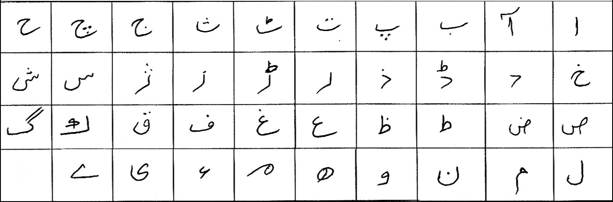

# hand-written-characters-recognition-via-deep-metric-learning
Code for the paper 'Hand Written Characters Recognition via Deep Metric Learning'
</br> Find the paper at: <a href='http://artelab.dista.uninsubria.it/res/research/papers/2018/2018-DAS-Nawaz.pdf'>CLICK HERE</a>
</br> The dataset WILL BE AVAILABLE SOON from: <a href='http://artelab.dista.uninsubria.it/publications.php'>CLICK HERE</a>.

# Dataset Description
Computer vision community has extensively used MNIST dataset in different applications including similarity. However, the dataset has only few seemingly similar classes, making it less effective for deep metric learning methods. In this paper, a new handwritten dataset named
Urdu-Characters is created in a similar way as MNIST dataset. 

# Dataset Images


# Citation
If you use the dataset and/or the code, consider citing the paper: 
```
@INPROCEEDINGS{2018:nawaz:DAS,
  author    ={S. Nawaz, A. Calefati, N. Ahmed, I. Gallo},
  booktitle ={13th IAPR International Workshop on Document Analysis Systems (DAS)},
  title     ={Hand Written Characters Recognition via Deep Metric Learning},
  year      ={2018},
  volume    ={05},
  pages     ={417-422},
  keywords  ={Handwritten dataset; Deep metric learning; Triplet network; Siamese network;},
  doi       ={10.1109/DAS.2018.18},
  ISBN13    ={978-1-5386-3346-5/18},
  month     ={Apr},
}
```

